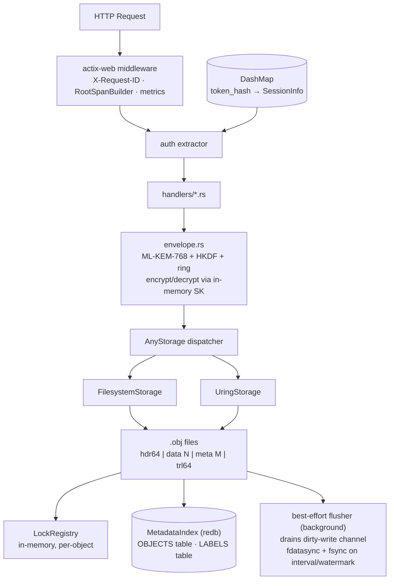
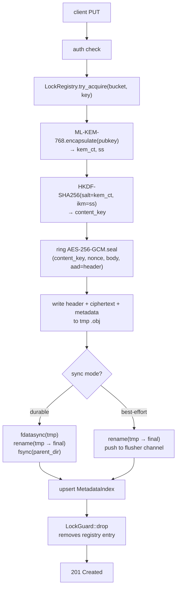
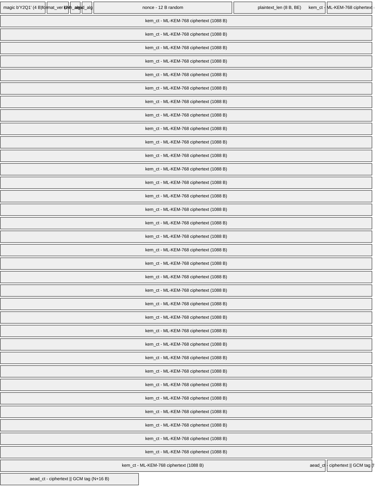
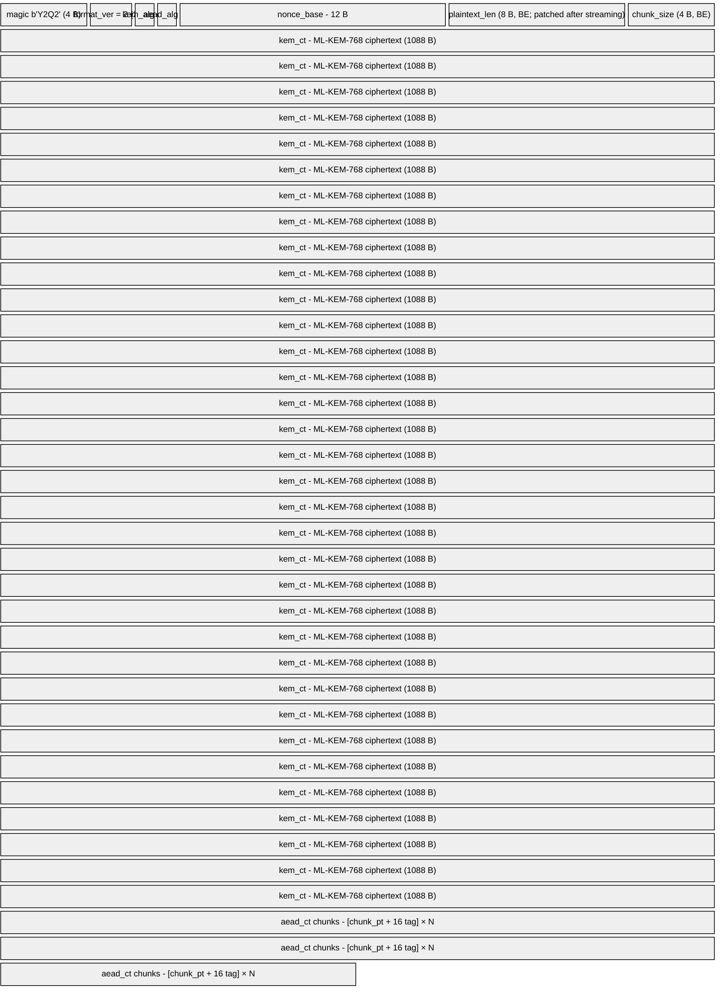
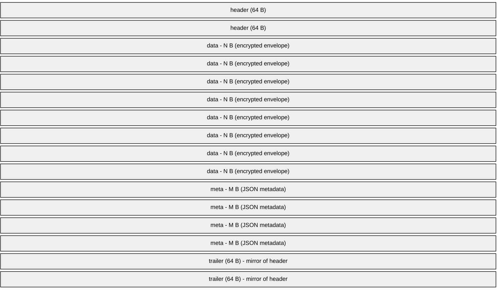
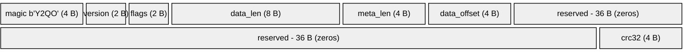
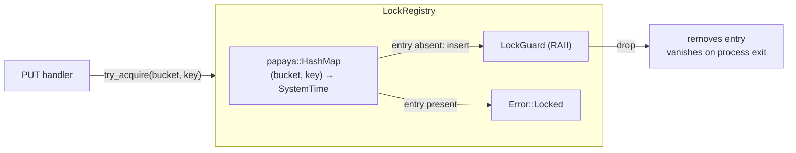
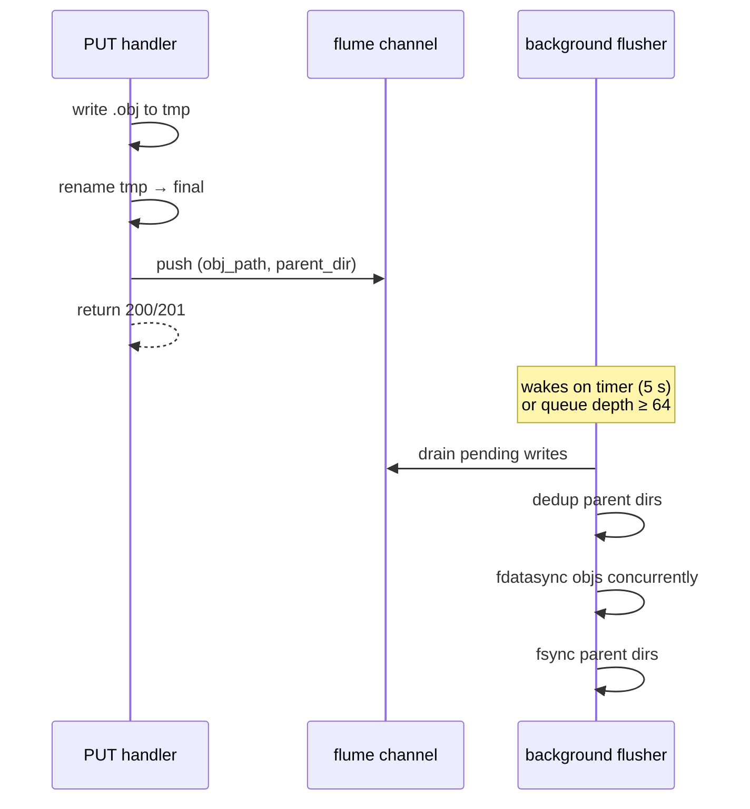

# Architecture

This document describes how `y2qd` is put together: the components, the encryption envelope, the storage backends, the metadata index, and the authentication model.

## Overview

`y2qd` is an HTTP daemon that exposes an object store. Every object is encrypted at rest using ML-KEM-768 key encapsulation feeding AES-256-GCM (via [ring](https://github.com/briansmith/ring)). The deployment's private key is never written to disk in plaintext - it is wrapped under each authorized user's password with Argon2id, unwrapped into process memory on successful login, and dropped when no sessions remain (subject to an optional idle timeout).

Two storage backends ship in tree:

- **Filesystem** (all platforms) - built on `tokio::fs`. Each object is a single `.obj` file with an embedded header, payload, metadata, and trailer. Default config value (`backend = "filesystem"`).
- **io_uring** (Linux only) - same `.obj` format, same on-disk layout, driven through `tokio-uring` with optional `O_DIRECT` alignment for large objects. Compiled in automatically on Linux (`#[cfg(target_os = "linux")]`, no cargo feature); absent on other targets, where selecting `backend = "uring"` returns a runtime error.

Both backends write the same format. A file written by the uring backend is readable by the filesystem backend and vice versa. A redb-backed metadata index makes listing cheap; it auto-rebuilds on startup and can be manually triggered at any time.



### PUT request flow



## Cryptography

### AES-256-GCM implementation

AES-256-GCM is implemented via [ring](https://github.com/briansmith/ring), which uses hardware AES-NI where available. This is 5-7× faster than the pure-Rust `aes-gcm` crate and is the performance-critical path for every PUT and GET.

### Envelope format

There are two on-disk envelope formats, distinguished by their magic bytes. **v2 (chunked) is the default** for new writes; v1 (whole-object) is still readable for objects written by older builds. Both wrap one ML-KEM-768 ciphertext and AES-256-GCM ciphertext behind a fixed header that doubles as additional authenticated data (AAD), so tampering with any header field invalidates the tag.

#### v1 - whole-object (legacy)



Fixed overhead is 1132 bytes (28 header + 1088 KEM + 16 tag). The whole object is one AEAD frame, so v1 cannot serve a partial decrypt - `Range` on a v1 object returns 501.

#### v2 - chunked (default)



The 32-byte fixed header plus the 1088-byte KEM ciphertext form a 1120-byte **preamble**, followed by `N` independently sealed chunks of `chunk_size` plaintext each (default 4 MiB, `crypto.envelope_chunk_size_bytes`). Chunk `i` uses `nonce_i = nonce_base XOR (i as u64 BE)`; the AAD for every chunk is the 32-byte fixed header. Because each chunk is its own frame at a deterministic offset, a `Range` GET reads and decrypts only the covering chunks (206), and a multi-GiB PUT streams chunk-by-chunk without buffering the whole object. `chunk_size` is recorded per object, so changing the config knob only affects future writes.

### Per-object key derivation

The content key is derived fresh for every PUT:

1. `(kem_ct, ss) := ML-KEM-768.encapsulate(public_key)` - fresh ephemeral, produces a 32-byte shared secret.
2. `content_key := HKDF-SHA256(salt = kem_ct, ikm = ss, info = b"y2q/v1/content-key")` - 32 bytes.
3. `ciphertext := AES-256-GCM.encrypt(content_key, nonce, plaintext, aad = header)`.

On GET the daemon does the reverse: parse the header, decapsulate with the in-memory secret key, re-derive the content key, decrypt and verify the tag.

The shared secret is *not* the content key directly. HKDF binds the content key to both `ss` and `kem_ct`, which means two encapsulations against the same public key can never collide on content key even if `ss` did.

### Secret-key protection at rest

The ML-KEM-768 secret key is 2400 bytes. It is never written to disk in plaintext.

- On first run, a 32-byte random root password is generated, encoded as URL-safe base64 (no padding), printed once to stdout, and used to derive a 32-byte KEK via Argon2id.
- The KEK wraps the secret key under AES-256-GCM (AAD = `b"y2q/v1/sk-wrap"`).
- The wrapped secret, together with the user's Argon2id parameters and salt, is stored as a `UserRecord` in `users.redb`.
- On login, the password is run through Argon2id (using that user's stored salt and parameters), the KEK is recomputed, and the secret key is unwrapped into a `Zeroizing<Vec<u8>>` that clears on drop.

Adding a new user is just "wrap the in-memory SK under the new user's password" - there is one canonical secret key shared across all users; each user just has their own wrapped copy.

### Argon2id parameters

Defaults (overridable per deployment in `[crypto.argon2]`):

| Parameter | Default | Notes |
|---|---|---|
| `m_cost_kib` | 65 536 (64 MiB) | OWASP "second-tier" recommendation |
| `t_cost` | 3 | iterations |
| `p_cost` | 4 | parallelism / lanes |
| salt | 16 random bytes | fresh per user record |

Each user's `UserRecord` records the parameters used at the time of password write, so existing users keep working when defaults change. A password change re-wraps with the *current* configured defaults.

### Key file layout

```
<keystore_dir>/
  pubkey.json    plaintext public key, algorithm, fingerprint
  users.redb     one row per user (wrapped SK + Argon2 params + metadata)
  .lock          POSIX advisory exclusive flock, held while daemon runs
```

`pubkey.json` schema:

```json
{
  "kem_alg": "ml-kem-768",
  "public_key_b64": "<base64 of 1184-byte public key>",
  "fingerprint_sha256": "<lowercase hex SHA-256 of raw PK bytes>"
}
```

`UserRecord` (JSON inside redb):

```json
{
  "username": "alice",
  "created_at": 1715000000000000000,
  "last_login": 1715000123000000000,
  "role": "admin",
  "kdf": { "m_cost_kib": 65536, "t_cost": 3, "p_cost": 4, "salt": "<b64>" },
  "wrapped_sk": { "nonce": "<b64>", "ciphertext": "<b64+tag>" }
}
```

`role` is the user's global role (`admin` | `user` | `readonly` | `writeonly` | `auditor` | `disabled`); see [Authorization](#authorization-roles-ownership-acls). In cluster mode, user records and bucket ownership/ACLs are replicated through the Raft control plane so a joined node inherits them.

## Storage

### Shared on-disk format

Both the filesystem and uring backends use the same single-file `.obj` format. Files written by either backend are fully readable by the other. An object at rest is one file:



The header and trailer each carry a CRC32 over their 64-byte record. A torn write is detectable by mismatching CRCs, and the surviving copy can be used for repair.

Header layout (little-endian):



### Filesystem backend

Each object is a single `.obj` file whose on-disk directory and filename are **keyed HMACs**, not the cleartext bucket/key:

```
<base_path>/<bucket_dir>/<object_id>.obj
  bucket_dir = hex(HMAC-SHA256(path_key, "y2q-bucket\0" || len(bucket) || bucket))
  object_id  = hex(HMAC-SHA256(path_key, "y2q-object\0" || len(bucket)||bucket || len(key)||key))
```

The `path_key` is derived from the login-gated MEK (deterministic from the deployment secret key), so the mapping is stable across restarts and backends but **the storage tree leaks neither bucket names nor object keys** to anyone who can read the directory - the names are irreversible without the key. This is why listing reads names from the encrypted index, not from the directory.

Bucket names: ASCII alphanumeric plus `-` and `_`; case-insensitive `"api"` is reserved (collides with `/api/v1/*`). Keys: up to 1024 bytes, no null bytes.

The metadata blob embedded in each `.obj` is **encrypted at rest** under the MEK (`encrypt_meta`, AES-256-GCM; `MEK = SHA-256(sk || "y2q-metadata-encryption-key-v2")`), so labels, timestamps, checksums, and the cleartext key are not readable from the file without the deployment key. Decrypted, it has this logical shape:

```json
{
  "created":         1715000000000000000,
  "modified":        1715000000000000000,
  "size":            12345,
  "checksum_gxhash": "<b64 8-byte gxhash64, 12 chars>",
  "bucket":          "my-bucket",
  "key":             "path/to/object",
  "disk_path":       "/var/lib/y2qd/objects/my-bucket/ab/cd/<uuid>.obj",
  "url_path":        "my-bucket/path/to/object",
  "labels":          { "owner": "alice" },
  "cipher_size":     13477,
  "cipher_sha256":   "<b64>",
  "kem_alg":         "ml-kem-768",
  "aead_alg":        "aes-256-gcm",
  "envelope_version": 2,
  "version":         null,
  "committed_at":    null
}
```

`size` is the plaintext length. `checksum_gxhash` is a non-cryptographic gxhash64 digest of the plaintext (corruption detection, not tamper detection). The `cipher_*` fields and algorithm names are always populated in current builds. `version` and `committed_at` are the CRAQ object version and local commit time; they are `null` outside cluster writes (legacy/single-node objects read as clean v0). The list/HEAD API surface (`MetadataView`) exposes the same fields except `disk_path`, `version`, and `committed_at`, which stay server-internal.

### Write locks (in-memory)

PUT operations are serialized per object by an in-memory `LockRegistry` backed by a lock-free `papaya::HashMap`. `try_acquire(bucket, key)` is atomic: it inserts `(bucket, key) → SystemTime::now()` via `try_insert` and returns `Error::Locked` if the entry already exists. A `LockGuard` removes the entry on drop.

Because locks are in-memory, they vanish on process exit - there are no orphaned lock files after a SIGKILL. `GET /api/v1/locks?older_than=...` lists currently-held locks whose acquisition timestamp exceeds the cutoff (these are stuck in-flight PUTs, not filesystem artifacts). `DELETE /api/v1/locks?older_than=...` force-releases them.



### io_uring backend

The uring backend uses the same shared `.obj` layout described above. The only structural difference is that large objects use `data_offset = 4096` (instead of 64) so the data section starts on a 4 KiB boundary, satisfying `O_DIRECT` alignment requirements on NVMe drives.

```
[ header   64 B   ]
[ padding  P B    ]   P = data_offset - 64  (0 on buffered path, 4032 on O_DIRECT path)
[ data     N B    ]
[ meta     M B    ]
[ trailer  64 B   ]
```

Files written by the uring backend can be read by the filesystem backend and vice versa. The `WRITTEN_O_DIRECT` flag bit in the header records which path was used at write time.

### Best-effort flusher

When a PUT arrives with `X-Y2Q-Sync: best-effort` (or `storage.default_sync = "best-effort"` is configured), the write path skips per-call `fdatasync`. Instead, the completed `(obj_path, parent_dir)` pair is pushed onto a `flume` channel. A background flusher task reads the channel and:

1. Deduplicates parent directories across pending writes.
2. `fdatasync`s each unique object file concurrently.
3. `fsync`s each unique parent directory.

The flusher wakes on a timer (`storage.sync_flush_interval_secs`, default 5 s) and also wakes early when the pending queue depth exceeds `storage.sync_flush_limit` (default 64). Best-effort PUTs are never dropped - if the daemon crashes before the flusher runs, a recently-PUT object may be lost even though the API returned 200/201.



### Durability summary

| X-Y2Q-Sync value | What happens before response | Crash safety |
|---|---|---|
| `durable` (default) | `fdatasync(obj)` + `fsync(parent_dir)` | crash-safe |
| `best-effort` | nothing; flushed asynchronously | may lose very recent writes |

## Metadata index

### Structure

The index is a single redb database with two tables:

| Table | Key | Value | Purpose |
|---|---|---|---|
| `OBJECTS` | `len(bucket) || bucket || len(key) || key` | JSON `Metadata` | Object lookup, bucket scans |
| `LABELS` | `len(name) || name || len(value) || value || len(bucket) || bucket || len(key) || key` | empty | Forward index for `label_name=value` queries |

All composite keys use a 4-byte big-endian length prefix per field, which makes lexicographic byte order match `(field1, field2, ...)` tuple order. That lets range scans answer "all objects in bucket B" and "all `(bucket, key)` pairs with label N=V" with no extra filtering.

### Encryption at rest

The entire `_y2q_index.redb` file is encrypted at rest. redb runs on top of a custom `StorageBackend` (`EncryptedFileBackend`) that transparently encrypts every 4 KiB block with AES-256-GCM (fresh per-block nonce, block index bound as AAD) and translates redb's logical offsets to physical ones. A small authenticated header records the logical file length. Inside the database, table keys and values are stored in the clear - the whole-file layer is the sole protection, so nothing about the schema, sizes, or contents leaks on disk.

The file key is derived from the login-gated MEK (`FK = HMAC-SHA256(MEK, "y2q-index-file-key-v1")`), which is only available while a session is active. Consequently the database is **opened on first login** and **closed on idle keystore drop** - while idle, only ciphertext remains and every index operation returns a "metadata index locked" error. The MEK (hence the file key) is deterministic from the deployment secret key, so the existing encrypted file reopens unchanged on the next login with no rewrapping.

Listing operations are implemented as bounded range scans:

- `list_buckets()` skip-walks the OBJECTS table - one read per bucket, jumping to the lex-successor of each bucket prefix. O(num_buckets) reads instead of O(num_objects).
- `scan_objects(bucket, prefix?, after?, limit)` range scans within the bucket, filters by `prefix`, paginates past `after`, and applies `limit`. Returns a `ListPage { items, next }`. Sorted ascending by key. `next` is `None` when the page is the last.

### Rebuild

The index is a cache. If it goes missing or corrupt, every operation still works against the on-disk truth (by reading `.obj` files directly) - just slower for listings. A pre-encryption (plaintext) index file from an older build is incompatible: on first open the encrypting backend detects the missing magic, recreates the file empty, and the rebuild below repopulates it. Two paths kick off a rebuild:

1. **Automatic startup rebuild** - on every boot the daemon walks the storage tree and reconciles the index against on-disk `.obj` files. Objects missing from the index are re-inserted; index rows whose `.obj` file is gone are removed and logged as data-loss events.
2. **Manual rebuild** - `POST /api/v1/rebuild` starts a background scan; `GET /api/v1/rebuild` polls progress.

Rebuild is fire-and-forget: GET and PUT continue to work during a rebuild. Listing may show stale data until rebuild completes.

## Authentication and sessions

### Token format

Session tokens are 32 cryptographically random bytes, encoded as URL-safe base64 (no padding) - 43 ASCII characters on the wire. The plaintext token is never persisted: the session store keys on `SHA-256(token)` and only the hash is held in memory. A leaked memory dump still cannot be replayed against a different process.

Wire format:

```
Authorization: Bearer <43-char base64url>
```

### Session store

In-memory `DashMap<[u8; 32], Arc<SessionInfo>>`. Each `SessionInfo` carries `(username, created_at, expires_at)`. There is no persistence: a daemon restart invalidates every session.

A background sweeper runs every `auth.session_sweep_interval_seconds` (default 300). On each pass it:

1. Iterates the session map and removes entries past `expires_at`.
2. Calls `keystore.reconcile(&sessions)` to drive idle-keystore drop.

### Lockout

Per-username failed login attempts are tracked in memory. Once `auth.max_failed_logins` consecutive failures hit, the username is locked for `auth.lockout_seconds`. Lockouts apply to malformed and valid usernames identically, so probing user existence isn't possible. A successful login or a lockout expiry resets the counter.

A floor of `auth.min_login_response_ms` (default 250 ms) is applied to both success and failure responses on login to smooth out timing differences between "user not found" and "wrong password".

### Idle keystore drop

The decrypted secret key lives in an `Arc<DecryptedKeystore>` held by the daemon's `KeystoreSlot`. While at least one active session exists, the slot holds the SK. When the last session expires the sweeper marks the slot's `empty_since`. Once `now - empty_since >= auth.keystore_idle_drop_seconds`, the SK is dropped and zeroized. The next login re-unwraps it from the user's password.

Default `keystore_idle_drop_seconds = 0` drops the SK immediately on the first sweep after the last session expires. Operators who want gap-tolerant uptime can extend it.

### Daemon-wide flock

On startup the daemon acquires a POSIX exclusive `flock` on `<keystore_dir>/.lock`. Two processes pointing at the same keystore would race on the user-store database; the flock makes the second one fail fast with a clear error.

### Authorization (roles, ownership, ACLs)

Authentication answers *who*; authorization answers *what they may do*, when `auth.enforce_authorization = true` (default). Two layers intersect:

- **Global role** - an account-wide capability ceiling stored on the `UserRecord`: `admin` (everything), `user` (governed by bucket grants), `readonly`/`writeonly` (read-or-write only on owned/granted buckets), `auditor` (read every bucket + read-only admin), `disabled` (nothing).
- **Per-bucket ownership + ACL** - each bucket has an owner (full control) and an optional grant map (`read`/`write`/`writeonly`/`admin`). New buckets are private to their creator. A bucket the caller has no relationship to is hidden: it is omitted from listings and any direct operation returns 404 (never 403), so existence cannot be probed; 403 appears only on a bucket you can already see but lack the verb for.

The effective capability for an action is the intersection of the role ceiling and the bucket relationship. With `enforce_authorization = false`, both layers are skipped and every authenticated user has full access (single-user / migration mode). Full model and status codes: [api.md](api.md#authorization).

## Distributed mode

> **Experimental.** Functional and covered by multi-node integration tests, but young and not yet recommended for production data. The single-node path (`cluster.enabled = false`, default) is unaffected.

`y2qd` optionally runs as a cluster. The **data plane** is CRAQ (chain replication with apportioned reads); the **control plane** is an embedded Raft controller (`y2q-cluster`) that replicates only topology plus low-volume user/bucket metadata - object data and per-object metadata never enter the Raft log. Every node loads the **same deployment keystore**, so the derived key hierarchy (and therefore the on-disk path for any `(bucket, key)`) is identical on every node and ciphertext is portable verbatim - replication and migration never re-encrypt. The integration seam is at the handler layer: the daemon routes through `DistributedStorage` (in `y2q-cluster`, wrapping a local `AnyStorage`) when `cluster.enabled = true`, and is byte-for-byte single-node when it is `false`. Full design: [clustering.md](clustering.md).

## Threat model (brief)

What the design defends against:

- **Disk theft** - an adversary with full read access to the storage tree learns object sizes, keys, labels, timestamps, and ciphertext, but cannot recover plaintext without the secret key.
- **Server-stored-credentials theft** - the user-store database contains only Argon2id-wrapped copies of the secret key; brute-forcing requires the configured Argon2 work per guess.
- **Quantum adversary** - ML-KEM-768 is a NIST-selected post-quantum KEM. The AES-256-GCM content key derivation is symmetric and unaffected by Shor.

What it doesn't defend against:

- **Compromised running daemon** - once the SK is unwrapped into memory, anything that can read process memory can read objects. The `keystore_idle_drop_seconds` shortens but doesn't eliminate this window.
- **Compromised client** - Bearer tokens are bearer credentials. A client that leaks one gives the holder full access until expiry or revocation.
- **Plaintext on the wire** - mitigated by the native TLS listener (`[server.tls]`), which can be restricted to the X25519MLKEM768 post-quantum hybrid key exchange and can enforce mutual TLS. When TLS is disabled the daemon serves plaintext HTTP and should sit behind a TLS-terminating reverse proxy.
- **Replay of encrypted payloads under a different key** - the daemon trusts whatever public key is in `pubkey.json` at process start. Key rotation is not yet implemented.

## Observability

### Per-request IDs

Every HTTP request is assigned a UUID (`X-Request-ID` header). The ID is propagated through tracing spans and appears in the SSE trace stream (`y2q admin trace`).

### Log events

A custom `RootSpanBuilder` emits an `INFO` event on every completed request (method, path, status, latency) and an `ERROR` event on 5xx responses. Log output is controlled by `[observability]` in config:

| Field | Values | Default |
|---|---|---|
| `log_filter` | RUST_LOG syntax (e.g. `"y2qd=debug,actix_web=info"`) | `"info"` |
| `log_format` | `"text"` (coloured) or `"json"` (structured, one object per line) | `"text"` |

The `RUST_LOG` environment variable takes precedence over `log_filter`.

### Metrics

Storage and auth metrics are exposed at `/metrics/prometheus` (Prometheus format) and `/metrics/dashboard` (in-browser) - but only when `server.unauthenticated_metrics = true`; otherwise neither endpoint (nor `/swagger-ui/`) is registered. Cluster builds add `y2qd_cluster_*` series (per-hop and full-chain commit latency, dirty-read version queries, local-vs-proxied read ratio, Raft term/leader/epoch, back-fill volume, stale-epoch rejections). Core series:

- `y2q_storage_ops_total{op,backend,result}` - operation counters
- `y2q_storage_duration_seconds{op,backend}` - latency histograms
- `y2q_auth_logins_total{result}` - login outcomes
- `y2q_active_sessions` - current session gauge

### Continuous profiling

When built with `--features pyroscope` and `[observability.pyroscope] enabled = true`, the daemon starts a Pyroscope agent before the HTTP server and stops it on graceful shutdown. The agent runs a background OS thread using SIGPROF (pprof-rs) and pushes CPU profiles to the configured server on each sample interval. It is fully independent of the tokio runtime. Tags `version` and `backend` are attached to every profile so flame graphs can be filtered by deployment variant.

## Source map

- [crates/y2q-core/src/crypto/envelope.rs](../crates/y2q-core/src/crypto/envelope.rs) - envelope format, encrypt/decrypt
- [crates/y2q-core/src/crypto/kdf.rs](../crates/y2q-core/src/crypto/kdf.rs) - Argon2id wrap/unwrap
- [crates/y2q-core/src/crypto/keystore.rs](../crates/y2q-core/src/crypto/keystore.rs) - pubkey.json, first-run, daemon flock
- [crates/y2q-core/src/crypto/user_store.rs](../crates/y2q-core/src/crypto/user_store.rs) - users.redb schema
- [crates/y2q-core/src/storage/filesystem.rs](../crates/y2q-core/src/storage/filesystem.rs) - filesystem backend, hex sharding, .obj writes
- [crates/y2q-core/src/storage/format.rs](../crates/y2q-core/src/storage/format.rs) - shared .obj header/trailer format (both backends)
- [crates/y2q-core/src/storage/locks.rs](../crates/y2q-core/src/storage/locks.rs) - in-memory LockRegistry
- [crates/y2q-core/src/storage/index.rs](../crates/y2q-core/src/storage/index.rs) - redb metadata index
- [crates/y2qd/src/auth/session.rs](../crates/y2qd/src/auth/session.rs) - session store, token hashing
- [crates/y2qd/src/auth/keystore.rs](../crates/y2qd/src/auth/keystore.rs) - in-memory keystore slot, idle drop
- [crates/y2qd/src/observability.rs](../crates/y2qd/src/observability.rs) - metrics setup, log format
- [crates/y2qd/src/tls.rs](../crates/y2qd/src/tls.rs) - rustls listener, PQ-hybrid kex, mutual TLS
- [crates/y2qd/src/authz.rs](../crates/y2qd/src/authz.rs) - bucket ownership / ACL / role enforcement
- [crates/y2q-cluster/](../crates/y2q-cluster/) - CRAQ data plane + embedded Raft control plane (see [clustering.md](clustering.md))
- [crates/y2qd/src/main.rs](../crates/y2qd/src/main.rs) - startup, lifecycle, route wiring
