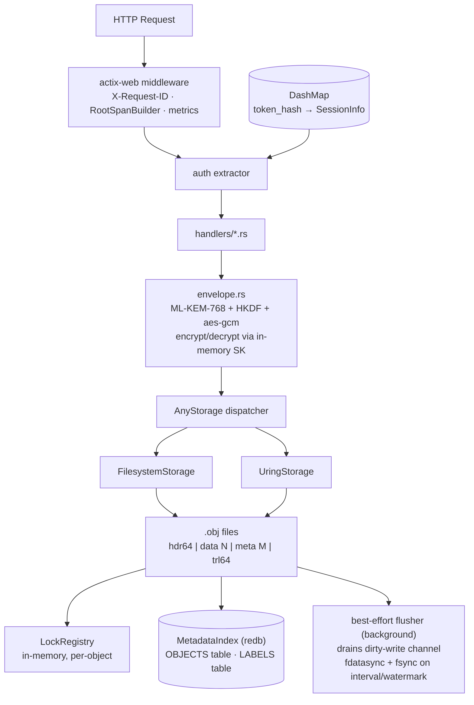
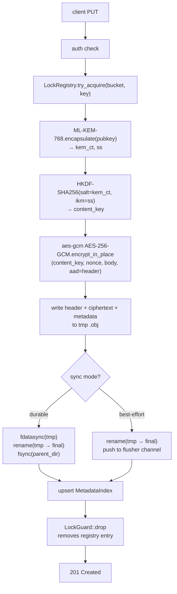
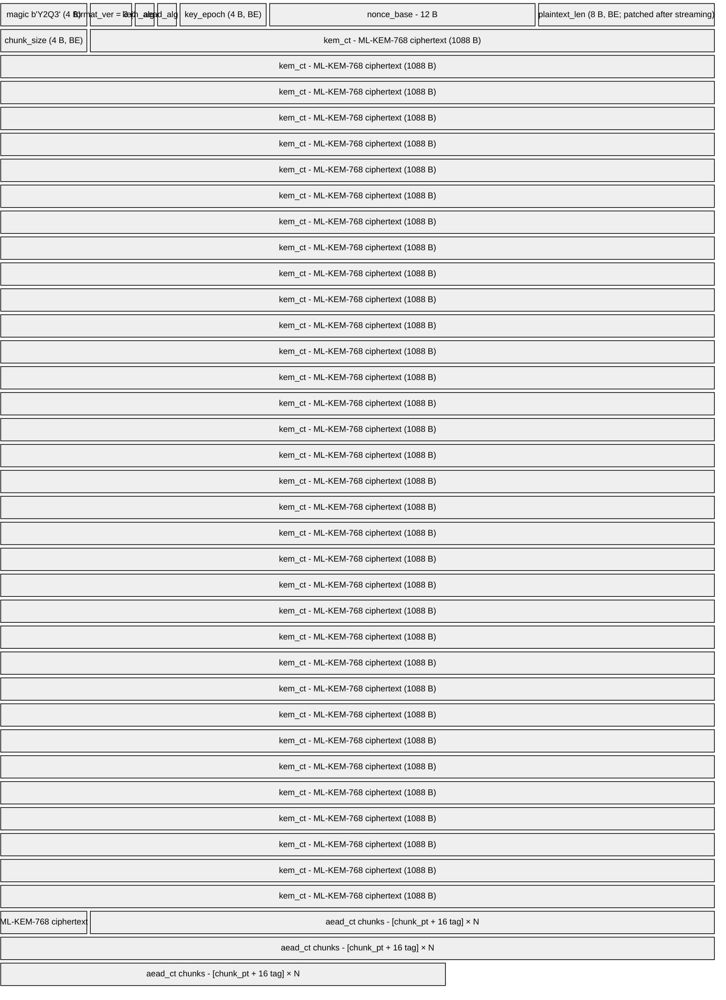
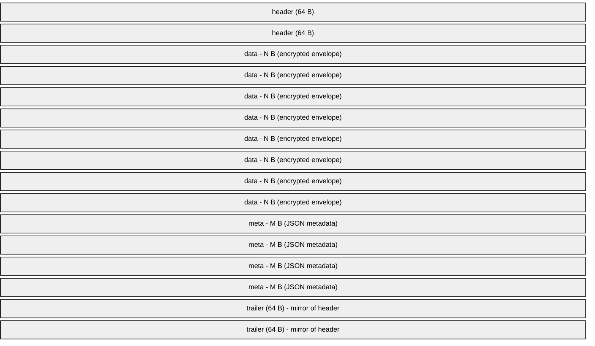
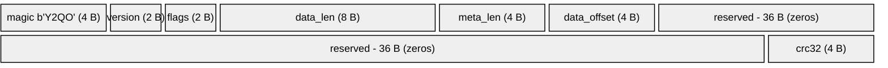
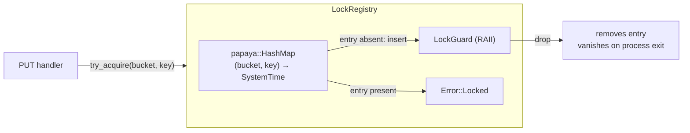
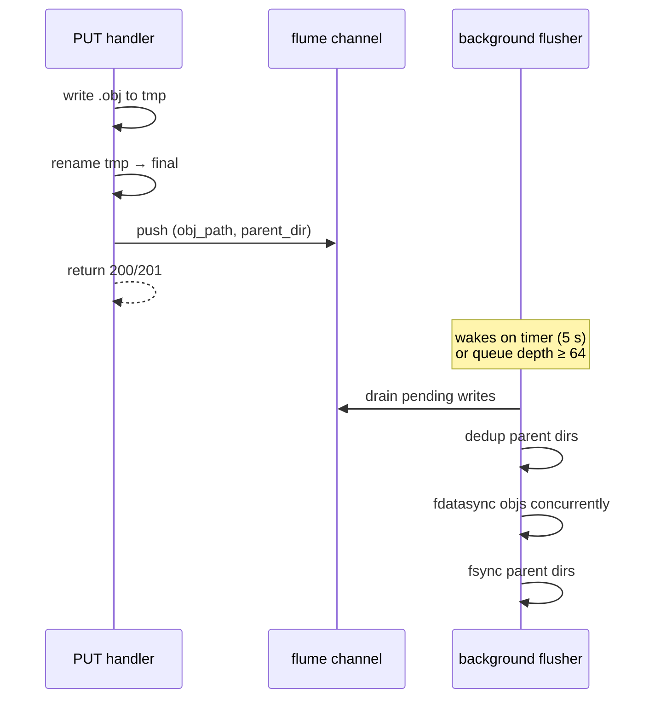

# Architecture

This document describes how `y2qd` is put together: the components, the encryption envelope, the storage backends, the metadata index, and the authentication model.

## Overview

`y2qd` is an HTTP daemon that exposes an object store. Every object is encrypted at rest using ML-KEM-768 key encapsulation feeding AES-256-GCM (via the pure-Rust [aes-gcm](https://github.com/RustCrypto/AEADs) crate). There is no single deployment-wide secret key: an operator-supplied node key drives server-structural encryption (index, paths, metadata), a per-persona identity keypair is wrapped under each password with Argon2id and unwrapped into that session's memory on login, and each bucket has its own keypair whose secret is sealed individually to every authorized grantee. See [Key hierarchy and identity protection at rest](#key-hierarchy-and-identity-protection-at-rest) below.

Two storage backends ship in tree:

- **Filesystem** (all platforms) - built on `tokio::fs`. Each object is a single `.obj` file with an embedded header, payload, metadata, and trailer. Default config value (`backend = "filesystem"`).
- **io_uring** (Linux only) - same `.obj` format, same on-disk layout, driven through `tokio-uring` with optional `O_DIRECT` alignment for large objects. Compiled in automatically on Linux (`#[cfg(target_os = "linux")]`, no cargo feature); absent on other targets, where selecting `backend = "uring"` returns a runtime error.

Both backends write the same format. A file written by the uring backend is readable by the filesystem backend and vice versa. A redb-backed metadata index makes listing cheap; it auto-rebuilds on startup and can be manually triggered at any time.


```mermaid
flowchart TD
    HTTP[HTTP Request] --> MW["actix-web middleware\nX-Request-ID · RootSpanBuilder · metrics"]
    MW --> AUTH[auth extractor]
    SESSIONS[("DashMap\ntoken_hash → SessionInfo")] --> AUTH
    AUTH --> HANDLERS["handlers/*.rs"]
    HANDLERS --> ENV["envelope.rs\nML-KEM-768 + HKDF + aes-gcm\nencrypt/decrypt via in-memory SK"]
    ENV --> STORAGE[AnyStorage dispatcher]
    STORAGE --> FS[FilesystemStorage]
    STORAGE --> URING[UringStorage]
    FS --> OBJ[".obj files\nhdr64 | data N | meta M | trl64"]
    URING --> OBJ
    OBJ --> LOCKS["LockRegistry\nin-memory, per-object"]
    OBJ --> INDEX[("MetadataIndex (redb)\nOBJECTS table · LABELS table")]
    OBJ --> FLUSHER["best-effort flusher (background)\ndrains dirty-write channel\nfdatasync + fsync on interval/watermark"]
```

### PUT request flow


```mermaid
flowchart TD
    C[client PUT] --> A[auth check]
    A --> L["LockRegistry.try_acquire(bucket, key)"]
    L --> K["ML-KEM-768.encapsulate(pubkey)\n→ kem_ct, ss"]
    K --> H["HKDF-SHA256(salt=kem_ct, ikm=ss)\n→ content_key"]
    H --> E["aes-gcm AES-256-GCM.encrypt_in_place\n(content_key, nonce, body, aad=header)"]
    E --> W["write header + ciphertext + metadata\nto tmp .obj"]
    W --> S{sync mode?}
    S -->|durable| D["fdatasync(tmp)\nrename(tmp → final)\nfsync(parent_dir)"]
    S -->|best-effort| B["rename(tmp → final)\npush to flusher channel"]
    D --> M[upsert MetadataIndex]
    B --> M
    M --> G["LockGuard::drop\nremoves registry entry"]
    G --> R[201 Created]
```

## Cryptography

### AES-256-GCM implementation

AES-256-GCM is implemented via the pure-Rust [aes-gcm](https://github.com/RustCrypto/AEADs) crate, which uses hardware AES-NI/NEON acceleration where the CPU and target support it, falling back to a constant-time software implementation elsewhere. This keeps the daemon buildable on any architecture Rust supports (it previously depended on `ring`, whose assembly backend only covers x86, x86_64, aarch64, and arm).

### Envelope format

There is a single on-disk envelope format (v3, chunked), identified by its magic bytes. It wraps one ML-KEM-768 ciphertext and a sequence of AES-256-GCM-sealed chunks behind a fixed header, most of which doubles as additional authenticated data (AAD) so tampering with it invalidates the tag - see [AAD coverage](#aad-coverage) below for the one field that's deliberately excluded. An envelope with an unrecognized magic - including the retired v1 whole-object format and the retired v2 single-deployment-key format - is rejected outright; there is no unauthenticated passthrough for unrecognized or legacy data.

#### v3 - chunked, per-bucket-epoch


```mermaid
%%{init: {"packet": {"showBits": false}}}%%
packet-beta
0-3: "magic b'Y2Q3' (4 B)"
4-5: "format_ver = 3 (2 B)"
6-6: "kem_alg (1)"
7-7: "aead_alg (1)"
8-11: "key_epoch (4 B, BE)"
12-23: "nonce_base - 12 B"
24-31: "plaintext_len (8 B, BE; patched after streaming)"
32-35: "chunk_size (4 B, BE)"
36-1123: "kem_ct - ML-KEM-768 ciphertext (1088 B)"
1124-1203: "aead_ct chunks - [chunk_pt + 16 tag] × N"
```

The 36-byte fixed header plus the 1088-byte KEM ciphertext form a 1124-byte **preamble**, followed by `N` independently sealed chunks of `chunk_size` plaintext each (default 4 MiB, `crypto.envelope_chunk_size_bytes`). Chunk `i` uses `nonce_i = nonce_base XOR (i as u64 BE)`. Because each chunk is its own frame at a deterministic offset, a `Range` GET reads and decrypts only the covering chunks (206), and a multi-GiB PUT streams chunk-by-chunk without buffering the whole object. `chunk_size` is recorded per object, so changing the config knob only affects future writes. `key_epoch` names which of the bucket's retained [`BucketKeyVersion`](#key-hierarchy-and-identity-protection-at-rest)s the `kem_ct` was encapsulated to, so a decryptor knows which epoch's bucket secret key to unwrap before decapsulating.

#### AAD coverage

The AAD for every chunk is `magic || format_ver || kem_alg || aead_alg || key_epoch || nonce_base || chunk_size` (28 of the header's 36 bytes) - every fixed-header field *except* `plaintext_len`. `plaintext_len` is the one field genuinely unknown until streaming finishes (it's patched in via a seek after the last chunk is written), so a placeholder bound into the AAD at encrypt time could never match what's read back at decrypt time. `chunk_size` and `key_epoch`, by contrast, are fixed before the first byte is written and have no such excuse, so they *are* authenticated.

### Per-object key derivation

The content key is derived fresh for every PUT, and bound to the object's address:

1. `(kem_ct, ss) := ML-KEM-768.encapsulate(public_key)` - fresh ephemeral, produces a 32-byte shared secret.
2. `content_key := HKDF-SHA256(salt = kem_ct, ikm = ss, info = b"y2q/v1/content-key" || len(bucket) || bucket || len(key) || key)` - 32 bytes.
3. `ciphertext := AES-256-GCM.encrypt(content_key, nonce, plaintext, aad)`.

On GET the daemon does the reverse: parse the header, decapsulate with the in-memory secret key, re-derive the content key using the **requested** `bucket`/`key` (not anything read from the file), decrypt and verify the tag.

The shared secret is *not* the content key directly. HKDF binds the content key to `ss`, `kem_ct`, and the object's address, which means two encapsulations against the same public key can never collide on content key even if `ss` did, and - more importantly - an envelope decrypted under any address other than the one it was written for derives the wrong key and fails the tag check. The `bucket`/`key` binding costs nothing (HKDF's `info` parameter is never transmitted or stored, only supplied by the caller at both ends) and closes a real gap: without it, the ciphertext carries no identity of its own, so a filesystem-write attacker could copy one object's on-disk envelope onto a different object's storage location and have it decrypt successfully there, handing that object's plaintext to anyone with ordinary read access to the *target* address - no access to the source object required.

### Key hierarchy and identity protection at rest

There is no longer a single deployment-wide secret key wrapped per user. Three tiers exist:

- **Tier 0 — node key.** Operator-supplied (`Y2QD_NODE_KEY` env var or `[crypto] node_key_file`), never auto-generated and never persisted anywhere inside `storage.base_path` or `crypto.keystore_dir` (the daemon refuses to start if it resolves there — a `cp -r` of the data must not carry its own key). It derives every server-structural key via HMAC-SHA256 (`prf`): the metadata-index file key, the path-blinding key, the object-metadata key, the bucket-config sidecar key, and a verifier stored in `keystore.json`. See [`crates/y2q-core/src/crypto/node_keys.rs`](../crates/y2q-core/src/crypto/node_keys.rs).
- **Tier 1 — per-persona identity keypair.** Every `UserRecord` carries exactly four credential slots, occupied or not (`CREDENTIAL_SLOTS`). A slot is one password's worth of identity: its own 2400-byte ML-KEM-768 secret key, wrapped under an Argon2id-derived KEK from that slot's password. All four slots of a record share one Argon2id salt; a per-slot AAD binding to `(username, slot_index)` is what stops a wrapped blob being relocated to a different slot or user. Unused slots hold a *real* keypair wrapped under discarded random bytes — byte-shape identical to a live slot — so nothing on disk reveals how many of a user's passwords are actually in use (see [Duress personas](#duress-personas)).
- **Tier 2 — per-bucket-per-epoch keypair.** Each bucket has its own ML-KEM-768 keypair per retained key epoch (`BucketKeyVersion`, ascending, newest used for new writes). Its secret is wrapped under a 32-byte bucket-wrap key (BWK) generated fresh per epoch and never itself persisted — instead the BWK is sealed once per credential slot of every grantee, so recovering it requires that grantee's own identity secret key.

On login, one Argon2id derivation (against the record's shared salt) yields a KEK; the daemon tries all four slots' unwrap *without short-circuiting*, so response timing never reveals which slot — real or decoy — actually opened, nor how many of the four are live. The recovered identity secret key lives only inside that session's `SessionInfo` (`crates/y2qd/src/auth/session.rs`), zeroized when the session is dropped — there is no process-wide keystore slot analogous to the old shared MEK, and nothing to idle-drop.

Content keys (tier 3, one per PUT — see [Per-object key derivation](#per-object-key-derivation) below) are now encapsulated to the bucket's *current-epoch* public key rather than one deployment-wide key, so a leaked object envelope names only a `key_epoch`, never anything that identifies a specific user.

### Argon2id parameters

Defaults (overridable per deployment in `[crypto.argon2]`):

| Parameter | Default | Notes |
|---|---|---|
| `m_cost_kib` | 65 536 (64 MiB) | OWASP "second-tier" recommendation |
| `t_cost` | 3 | iterations |
| `p_cost` | 4 | parallelism / lanes |
| salt | 16 random bytes | fresh per user record |

Each user's `UserRecord` records the parameters used at the time of password write, so existing users keep working when defaults change. A password change re-wraps with the *current* configured defaults.

### Key file layout

```
<keystore_dir>/
  keystore.json  node-key verifier (never the key itself)
  users.redb     one row per user (four credential slots + Argon2 params + metadata)
  .lock          POSIX advisory exclusive flock, held while daemon runs
```

A directory still holding a pre-hierarchy `pubkey.json` is refused outright (`CryptoError::LegacyKeystore`) — there is no conversion path; re-initialize the deployment.

`keystore.json` schema:

```json
{
  "format_version": 1,
  "node_key_verifier_b64": "<base64 of HMAC-SHA256(node_key, \"y2q/v3/node-key-verifier\")>",
  "created_at": 1715000000000000000
}
```

`UserRecord` (JSON inside redb):

```json
{
  "username": "alice",
  "created_at": 1715000000000000000,
  "last_login": 1715000123000000000,
  "role": "user",
  "kdf": { "m_cost_kib": 65536, "t_cost": 3, "p_cost": 4, "salt": "<b64>" },
  "slots": [
    { "identity_pk_b64": "<b64>", "wrapped": { "nonce": "<b64>", "ciphertext": "<b64+tag>" } },
    { "identity_pk_b64": "<b64>", "wrapped": { "nonce": "<b64>", "ciphertext": "<b64+tag>" } },
    { "identity_pk_b64": "<b64>", "wrapped": { "nonce": "<b64>", "ciphertext": "<b64+tag>" } },
    { "identity_pk_b64": "<b64>", "wrapped": { "nonce": "<b64>", "ciphertext": "<b64+tag>" } }
  ]
}
```

`slots` always has exactly four entries — real and decoy personas are byte-shape identical (same-length wrapped ciphertext), so the record itself never reveals how many passwords are actually live. `role` is the user's global role (`admin` | `user` | `readonly` | `writeonly` | `auditor` | `disabled`); see [Authorization](#authorization-roles-ownership-acls).


## Storage

### Shared on-disk format

Both the filesystem and uring backends use the same single-file `.obj` format. Files written by either backend are fully readable by the other. An object at rest is one file:


```mermaid
%%{init: {"packet": {"showBits": false}}}%%
packet-beta
0-63: "header (64 B)"
64-319: "data - N B (encrypted envelope)"
320-447: "meta - M B (JSON metadata)"
448-511: "trailer (64 B) - mirror of header"
```

The header and trailer each carry a CRC32 over their 64-byte record. A torn write is detectable by mismatching CRCs, and the surviving copy can be used for repair.

Header layout (little-endian):


```mermaid
%%{init: {"packet": {"showBits": false}}}%%
packet-beta
0-3: "magic b'Y2QO' (4 B)"
4-5: "version (2 B)"
6-7: "flags (2 B)"
8-15: "data_len (8 B)"
16-19: "meta_len (4 B)"
20-23: "data_offset (4 B)"
24-59: "reserved - 36 B (zeros)"
60-63: "crc32 (4 B)"
```

### Filesystem backend

Each object is a single `.obj` file whose on-disk directory and filename are **keyed HMACs**, not the cleartext bucket/key:

```
<base_path>/<bucket_dir>/<object_id>.obj
  bucket_dir = hex(HMAC-SHA256(path_key, "y2q-bucket\0" || len(bucket) || bucket))
  object_id  = hex(HMAC-SHA256(path_key, "y2q-object\0" || len(bucket)||bucket || len(key)||key))
```

The `path_key` is derived from the node key (tier 0, operator-supplied — see [Key hierarchy](#key-hierarchy-and-identity-protection-at-rest) above), so the mapping is stable across restarts and backends but **the storage tree leaks neither bucket names nor object keys** to anyone who can read the directory - the names are irreversible without the node key. This is why listing reads names from the encrypted index, not from the directory.

Bucket names: ASCII alphanumeric plus `-` and `_`; case-insensitive `"api"` is reserved (collides with `/api/v1/*`). Keys: up to 1024 bytes, no null bytes.

The metadata blob embedded in each `.obj` is **encrypted at rest** under the tier-0 Object Metadata Key (OMK, derived from the node key via `prf`), so labels, timestamps, checksums, and the cleartext key are not readable from the file without the node key. It is one fixed key for the whole deployment rather than per-object, so `encrypt_meta`/`decrypt_meta` bind the AEAD to the object's opaque on-disk id (the `.obj` filename stem, itself a keyed HMAC of `bucket`/`key`) via AAD - the same identity-binding principle as the envelope above, closing the same copy-attack: a metadata blob relocated to a different object's storage location fails the tag check instead of decrypting into a spoofed size/labels/checksum. **Metadata stays at tier 0, not per-bucket** - see [Key hierarchy](#key-hierarchy-and-identity-protection-at-rest) above for the accepted tradeoff this implies.

```json
{
  "created":         1715000000000000000,
  "modified":        1715000000000000000,
  "size":            12345,
  "checksum_gxhash": "<b64 8-byte XXH3-64, 12 chars>",
  "bucket":          "my-bucket",
  "key":             "path/to/object",
  "disk_path":       "/var/lib/y2qd/objects/my-bucket/ab/cd/<uuid>.obj",
  "url_path":        "my-bucket/path/to/object",
  "labels":          { "owner": "alice" },
  "cipher_size":     13477,
  "cipher_checksum": "<b64 8-byte XXH3-64, 12 chars>",
  "kem_alg":         "ml-kem-768",
  "aead_alg":        "aes-256-gcm",
  "envelope_version": 3,
  "version":         null,
  "committed_at":    null
}
```

`size` is the plaintext length. `checksum_gxhash` is a non-cryptographic XXH3-64 digest of the plaintext (corruption detection, not tamper detection). The `cipher_*` fields and algorithm names are always populated in current builds. `version` and `committed_at` are reserved fields, always `null` in this build (objects read as clean v0). The list/HEAD API surface (`MetadataView`) exposes the same fields except `disk_path`, `version`, and `committed_at`, which stay server-internal.

### Write locks (in-memory)

PUT operations are serialized per object by an in-memory `LockRegistry` backed by a lock-free `papaya::HashMap`. `try_acquire(bucket, key)` is atomic: it inserts `(bucket, key) → SystemTime::now()` via `try_insert` and returns `Error::Locked` if the entry already exists. A `LockGuard` removes the entry on drop.

Because locks are in-memory, they vanish on process exit - there are no orphaned lock files after a SIGKILL. `GET /api/v1/locks?older_than=...` lists currently-held locks whose acquisition timestamp exceeds the cutoff (these are stuck in-flight PUTs, not filesystem artifacts). `DELETE /api/v1/locks?older_than=...` force-releases them.


```mermaid
flowchart LR
    PUT["PUT handler"] -->|"try_acquire(bucket, key)"| LR
    subgraph LR["LockRegistry"]
        MAP["papaya::HashMap\n(bucket, key) → SystemTime"]
        MAP -->|"entry absent: insert"| GUARD["LockGuard (RAII)"]
        MAP -->|"entry present"| ERR["Error::Locked"]
    end
    GUARD -->|"drop"| REMOVE["removes entry\nvanishes on process exit"]
```

### io_uring backend

The uring backend uses the same shared `.obj` layout described above. The only structural difference is that large objects use `data_offset = 4096` (instead of 64) so the data section starts on a 4 KiB boundary, satisfying `O_DIRECT` alignment requirements on NVMe drives.

```
[ header   64 B   ]
[ padding  P B    ]   P = data_offset - 64  (0 on buffered path, 4032 on O_DIRECT path)
[ data     N B    ]
[ meta     M B    ]
[ trailer  64 B   ]
```

Files written by the uring backend can be read by the filesystem backend and vice versa. The `WRITTEN_O_DIRECT` flag bit in the header records which path was used at write time.

### Best-effort flusher

When a PUT arrives with `X-Y2Q-Sync: best-effort` (or `storage.default_sync = "best-effort"` is configured), the write path skips per-call `fdatasync`. Instead, the completed `(obj_path, parent_dir)` pair is pushed onto a `flume` channel. A background flusher task reads the channel and:

1. Deduplicates parent directories across pending writes.
2. `fdatasync`s each unique object file concurrently.
3. `fsync`s each unique parent directory.

The flusher wakes on a timer (`storage.sync_flush_interval_secs`, default 5 s) and also wakes early when the pending queue depth exceeds `storage.sync_flush_limit` (default 64). Best-effort PUTs are never dropped - if the daemon crashes before the flusher runs, a recently-PUT object may be lost even though the API returned 200/201.


```mermaid
sequenceDiagram
    participant P as PUT handler
    participant CH as flume channel
    participant FL as background flusher

    P->>P: write .obj to tmp
    P->>P: rename tmp → final
    P->>CH: push (obj_path, parent_dir)
    P-->>P: return 200/201

    Note over FL: wakes on timer (5 s)<br/>or queue depth ≥ 64
    FL->>CH: drain pending writes
    FL->>FL: dedup parent dirs
    FL->>FL: fdatasync objs concurrently
    FL->>FL: fsync parent dirs
```

### Durability summary

| X-Y2Q-Sync value | What happens before response | Crash safety |
|---|---|---|
| `durable` (default) | `fdatasync(obj)` + `fsync(parent_dir)` | crash-safe |
| `best-effort` | nothing; flushed asynchronously | may lose very recent writes |

## Metadata index

### Structure

The index is a single redb database with four tables:

| Table | Key | Value | Purpose |
|---|---|---|---|
| `OBJECTS` | `HMAC-SHA256(IK, "idx-bucket\0"‖bucket)` ‖ `HMAC-SHA256(IK, "idx-object\0"‖bucket‖key)` | AEAD-sealed (OMK) JSON `Metadata` | Object lookup, bucket scans |
| `LABELS` | blinded `(label_name, label_value)` prefix ‖ blinded `(bucket, key)` suffix (same scheme as `OBJECTS`) | AEAD-sealed `(bucket, key)` pair | Forward index for `label_name=value` queries |
| `BUCKETS` | `HMAC-SHA256(IK, "idx-bucket\0"‖bucket)` | AEAD-sealed bucket name | Registry of explicitly-created (possibly empty) buckets |
| `META` | `"schema_version"` | plaintext version byte | Detects an index written under an older key/value scheme (see Rebuild below) |

Every field is length-prefixed before hashing, so blinding is domain-separated and unambiguous (`bucket="ab", key="c"` can never collide with `bucket="a", key="bc"`). Rows for the same bucket share the leading 32 bytes of their key, which is what keeps the per-bucket range scans below working without the key ever containing the plaintext bucket name.

### Encryption at rest

The entire `_y2q_index.redb` file is encrypted at rest, as it always has been: redb runs on top of a custom `StorageBackend` (`EncryptedFileBackend`) that transparently encrypts every 4 KiB block with AES-256-GCM (fresh per-block nonce, block index bound as AAD) and translates redb's logical offsets to physical ones. A small authenticated header records the logical file length.

On top of that, every table key and value carries a second, row-level layer (see Structure above): keys are HMAC-SHA256-blinded under the Index Key (`IK = prf(node_key, "index-key")`) and values are AEAD-sealed under the Object Metadata Key (OMK — the same key that seals the on-disk `.obj` sidecar), bound to their own blinded row key via AAD so a sealed value can't be replayed into a different row. Blinding is deterministic, so point lookups and range scans keep working without ever touching a plaintext string. redb's own page cache is also capped (`storage.index_cache_size_bytes`, default 64 MiB, versus redb's 1 GiB default) to bound how much decrypted content can be resident in the cache at once.

**What the row-level layer does and doesn't buy.** Whole-file encryption alone means that once redb decrypts a page into its own page cache, anything on that page — bucket names, object keys, label names/values — sits in cleartext in process memory for as long as the page stays cached, which given `list_buckets`/`search_labels`/index-rebuild all touch every row, is effectively the daemon's whole uptime. Row-level blinding/sealing closes exactly that gap: the raw bytes redb hands back from a decrypted page are opaque HMAC output and AEAD ciphertext, not a recoverable string, regardless of how long the page stays cached. It does **not**, however, raise the bar against a node-key holder or an attacker who can read the running daemon's memory: IK and OMK are both derived from the node key and held, like every tier-0 key, in `NodeKeySlot` for the daemon's entire lifetime with no idle-drop — the same memory an attacker would need cache-page access from in the first place. See [the accepted node-key-holder tradeoff](#threat-model-brief) below, which this does not change.

The file key is derived from the node key (`IFK = prf(node_key, "index-file-key")`), which is resident in memory for the daemon's whole lifetime once boot completes - there is no idle-drop for it (see [Session-scoped identity keys](#session-scoped-identity-keys) below). Because the node key never changes without an explicit offline rotation (`y2qd --rotate-node-key`), the existing encrypted file reopens unchanged across restarts with no rewrapping.

Listing operations are implemented as bounded range scans:

- `list_buckets()` skip-walks the OBJECTS table - one read per bucket, jumping to the lex-successor of each bucket's blinded prefix. O(num_buckets) reads instead of O(num_objects). The bucket name itself comes from decrypting that one representative row's value, since the row key is opaque HMAC bytes and can't be decoded back.
- `scan_objects(bucket, prefix?, after?, limit)` range scans within the bucket, filters by `prefix`, paginates past `after`, and applies `limit`. Returns a `ListPage { items, next }`. Sorted ascending by key. `next` is `None` when the page is the last.

### Rebuild

The index is a cache. If it goes missing or corrupt, every operation still works against the on-disk truth (by reading `.obj` files directly) - just slower for listings. A pre-encryption (plaintext) index file from an older build is incompatible: on first open the encrypting backend detects the missing magic, recreates the file empty, and the rebuild below repopulates it. An index still written under the pre-blinding key/value scheme (schema version 1, or missing the `META` marker entirely) is detected the same way — via the marker, not the file magic — and wiped rather than risking a misread of incompatible rows. Two paths kick off a rebuild:

1. **Automatic startup rebuild** - on every boot the daemon walks the storage tree and reconciles the index against on-disk `.obj` files. Objects missing from the index are re-inserted; index rows whose `.obj` file is gone are removed and logged as data-loss events.
2. **Manual rebuild** - `POST /api/v1/rebuild` starts a background scan; `GET /api/v1/rebuild` polls progress.

Rebuild is fire-and-forget: GET and PUT continue to work during a rebuild. Listing may show stale data until rebuild completes.

## Authentication and sessions

### Token format

Session tokens are 32 cryptographically random bytes, encoded as URL-safe base64 (no padding) - 43 ASCII characters on the wire. The plaintext token is never persisted: the session store keys on `SHA-256(token)` and only the hash is held in memory. A leaked memory dump still cannot be replayed against a different process.

Wire format:

```
Authorization: Bearer <43-char base64url>
```

### Session store

In-memory `DashMap<[u8; 32], Arc<SessionInfo>>`. Each `SessionInfo` carries the username, global role, timestamps, this persona's slot index, its unwrapped identity secret key (zeroized on drop), and a bounded per-session bucket-key cache. There is no persistence: a daemon restart invalidates every session.

A background sweeper runs every `auth.session_sweep_interval_seconds` (default 300). On each pass it:

1. Iterates the session map and removes entries past `expires_at`.

### Lockout

Per-username failed login attempts are tracked in memory. Once `auth.max_failed_logins` consecutive failures hit, the username is locked for `auth.lockout_seconds`. Lockouts apply to malformed and valid usernames identically, so probing user existence isn't possible. A successful login or a lockout expiry resets the counter.

A floor of `auth.min_login_response_ms` (default 250 ms) is applied to both success and failure responses on login to smooth out timing differences between "user not found" and "wrong password".

### Session-scoped identity keys

There is no process-wide keystore slot to idle-drop anymore. Tier 0 (node key) is resident for the daemon's whole lifetime once boot completes - the daemon cannot serve anything without it. Tier 1 (a persona's identity secret key) lives only inside that login's `SessionInfo`, bounded by `[auth] max_ttl_seconds`/`default_ttl_seconds` and zeroized on session drop; a compromised request handler observes exactly one session's key material, never every user's. Operators who want a shorter exposure window for identity keys should shorten the session TTL rather than looking for an idle-drop knob - there isn't one.

### Daemon-wide flock

On startup the daemon acquires a POSIX exclusive `flock` on `<keystore_dir>/.lock`. Two processes pointing at the same keystore would race on the user-store database; the flock makes the second one fail fast with a clear error.

### Authorization (roles, ownership, ACLs)

Authentication answers *who*; authorization answers *what they may do*, when `auth.enforce_authorization = true` (default). Two layers intersect, plus a third crypto-layer gate that global roles do **not** bypass:

- **Global role** - an account-wide capability ceiling stored on the `UserRecord`: `admin` (everything), `user` (governed by bucket grants), `readonly`/`writeonly` (read-or-write only on owned/granted buckets), `auditor` (read every bucket + read-only admin), `disabled` (nothing).
- **Per-bucket ownership + ACL** - each bucket has an owner (full control) and an optional grant map (`read`/`write`/`writeonly`/`admin`). New buckets are private to their creator. A bucket the caller has no relationship to is hidden: it is omitted from listings and any direct operation returns 404 (never 403), so existence cannot be probed; 403 appears only on a bucket you can already see but lack the verb for.
- **Cryptographic bucket-key grant** - *strict admin exclusion*. A global `admin`/`auditor` role satisfies the first two layers for every bucket (so `GET /` lists every bucket name), but reading an object additionally requires the caller's *persona* to hold a real, sealed bucket-key grant (`bucket_keys::resolve_read_key`) - a role ceiling alone confers none. A compromised admin account with no bucket grant of its own can therefore see bucket/object *names*, sizes, and labels (tier-0 metadata, see above) but not decrypt a single byte of plaintext it wasn't explicitly granted. There is no admin group key, no escrow, and no break-glass path - this is enforced identically whether or not the request even reaches `authorize_bucket`'s ACL check.

The effective capability for an action is the intersection of the role ceiling and the bucket relationship, further gated by the cryptographic grant for reads. With `enforce_authorization = false`, the ACL/role layers are skipped (single-user / migration mode) - the crypto-layer grant still applies regardless, since it isn't an authorization *policy*, it's what the object is physically encrypted under. Full model and status codes: [api.md](api.md#authorization).

### Duress personas

Every `UserRecord` carries four credential slots (see [Key hierarchy](#key-hierarchy-and-identity-protection-at-rest)); each account's real identity is placed at a slot chosen uniformly at random on creation - there is no privileged slot number a caller or a coercer can rely on - and the other three are self-service alternates a user can populate via `POST /api/v1/personas` (`y2q persona add`). Each persona is a fully separate identity with its own bucket grants - there is no shared-access, silent-alarm design. A persona created with `revoke_other_sessions: true` silently switches every other live session of the account over to itself on login, in place - same tokens, same expiry, no revocation and nothing observably interrupted, just narrower access from that point on. This is the only side effect of a duress login, and it is not observable as one: no alert, no log line, and no metric distinguishes it from an ordinary one (`y2q_auth_logins_total{result}` never gains a duress label; `GET /api/v1/personas/me` never reports the duress flag, even for the caller's own session). A bucket the duress persona wasn't granted is 404, not 403, to it - identical to any bucket that genuinely doesn't exist. So a 403 can never be used to confirm a real bucket's existence and betray the primary password. Granting reaches only the grantee's real identity (`UserRecord::primary_slot`, resolved server-side, never returned by any API) from a third party; sharing access with one of your own alternate personas is self-service (`POST /api/v1/personas/{slot}/grant`), because a third party granting a *named* alternate persona would first have to know it exists.

## Threat model (brief)

What the design defends against:

- **Disk theft** - an adversary with full read access to the storage tree learns object sizes, keys, labels, timestamps, and ciphertext, but cannot recover any object's plaintext without both the node key (tier 0, to find and decrypt metadata) and the specific bucket's key (tier 2, sealed to individual grantees) - the node key alone is not enough.
- **A compromised administrator account** - this is the central property the per-bucket key hierarchy exists for. `admin`/`auditor` are cryptographically excluded from object plaintext: their role satisfies authorization but never confers a bucket-key grant, so `GET`ing an object they weren't explicitly granted fails at the crypto layer (403) regardless of role. There is no admin group key, no escrow secret, and no break-glass self-grant - an admin can only read what they hold a real grant for, exactly like any other user.
- **A compromised, less-privileged account** - a `readonly`/`writeonly`/`user` account's blast radius is bounded to exactly the buckets that account was granted, not the whole deployment. Revoking a grant (`set_acl`), rotating the bucket's key (`rotate-key`), and rekeying its objects (`rekey`) closes even a leaked *old* bucket key without requiring a redeploy - see [operations.md](operations.md#key-rotation).
- **Coercion to reveal a password** - a user who set up a duress persona (see [Duress personas](#duress-personas)) can hand over an alternate password that unlocks a separate, deniable identity holding only decoy buckets; a coercer cannot distinguish a duress persona's login, session, or 404s from an ordinary account with no access, and cannot tell from a `UserRecord`/`BucketKeyVersion`'s byte shape how many of a user's four slots are actually live.
- **Server-stored-credentials theft** - the user-store database contains only Argon2id-wrapped copies of each persona's identity secret key; brute-forcing requires the configured Argon2 work per guess, once per slot tried.
- **Quantum adversary** - ML-KEM-768 is a NIST-selected post-quantum KEM, used at every tier (node-key-derived encryption is symmetric HMAC/AES-GCM and likewise unaffected by Shor). The AES-256-GCM content-key derivation is symmetric throughout.

What it doesn't defend against:

- **Compromised running daemon** - once a persona's identity secret key is unwrapped into memory (on login), anything that can read that request's process memory can read whatever that persona holds a grant for. Session TTL (`[auth] max_ttl_seconds`) bounds this window; there is no idle-drop knob to shorten it further (see [Session-scoped identity keys](#session-scoped-identity-keys)). Tier-0 keys (index, path, object-metadata, bucket-config, container-header) are resident for the daemon's *entire* lifetime with no idle-drop at all, so the same memory access also recovers whatever those protect - including the keys the metadata index's row-level blinding/sealing uses (see [Metadata index](#metadata-index)).
- **The node key holder** - metadata (object sizes, labels, cleartext keys, bucket names) is encrypted at tier 0, not per-bucket, so a node-key-holding operator or attacker sees the *shape* of the deployment - which buckets exist, how many objects, their labels and sizes - without ever seeing content. This is an accepted, deliberate consequence of keeping the metadata index reconstructible without every bucket's key (see the Filesystem backend section above). The metadata index's row-level blinding/sealing (see [Metadata index](#metadata-index)) closes a *decrypted-page-without-the-node-key* exposure - it does not change this tradeoff, since a node-key holder derives the same blinding/sealing keys the daemon does.
- **Compromised client** - Bearer tokens are bearer credentials. A client that leaks one gives the holder full access until expiry or revocation.
- **Plaintext on the wire** - mitigated by the native TLS listener (`[server.tls]`), which can be restricted to the X25519MLKEM768 post-quantum hybrid key exchange and can enforce mutual TLS. When TLS is disabled the daemon serves plaintext HTTP and should sit behind a TLS-terminating reverse proxy.
- **A stolen node key by itself** - it unlocks metadata and paths, but not object plaintext; combined with disk access it still requires each bucket's own key material (sealed to specific personas) to decrypt anything.

## Observability

### Per-request IDs

Every HTTP request is assigned a UUID (`X-Request-ID` header). The ID is propagated through tracing spans and appears in the SSE trace stream (`y2q admin trace`).

### Log events

A custom `RootSpanBuilder` emits an `INFO` event on every completed request (method, path, status, latency) and an `ERROR` event on 5xx responses. Log output is controlled by `[observability]` in config:

| Field | Values | Default |
|---|---|---|
| `log_filter` | RUST_LOG syntax (e.g. `"y2qd=debug,actix_web=info"`) | `"info"` |
| `log_format` | `"text"` (coloured) or `"json"` (structured, one object per line) | `"text"` |

The `RUST_LOG` environment variable takes precedence over `log_filter`.

### Metrics

Storage and auth metrics are exposed at `/metrics/prometheus` (Prometheus format) and `/metrics/dashboard` (in-browser) - but only when `server.unauthenticated_metrics = true`; otherwise neither endpoint (nor `/swagger-ui/`) is registered. Core series:

- `y2q_storage_ops_total{op,backend,result}` - operation counters
- `y2q_storage_duration_seconds{op,backend}` - latency histograms
- `y2q_auth_logins_total{result}` - login outcomes
- `y2q_active_sessions` - current session gauge

### Continuous profiling

When built with `--features pyroscope` and `[observability.pyroscope] enabled = true`, the daemon starts a Pyroscope agent before the HTTP server and stops it on graceful shutdown. The agent runs a background OS thread using SIGPROF (pprof-rs) and pushes CPU profiles to the configured server on each sample interval. It is fully independent of the tokio runtime. Tags `version` and `backend` are attached to every profile so flame graphs can be filtered by deployment variant.

## Platform support

y2q targets any architecture the Rust toolchain supports. The two formerly arch-restrictive dependencies (`gxhash`, hardware-AES-only checksums, and `ring`, assembly-only AEAD) have been replaced with pure-Rust equivalents (`xxhash-rust` XXH3-64 and the RustCrypto `aes-gcm` crate), so the daemon, CLI, and client build on `x86_64`, `aarch64`, `riscv64gc`, `powerpc64le`, `s390x`, `loongarch64`, and other Linux targets the toolchain provides a `std` for. The daemon (`y2qd`) requires Linux; the CLI and client crates are not Linux-bound and also build on macOS.

**Datasets are not cross-platform compatible, and this is intentional, not a gap to be filled.** Checksums, on-disk layout, and the encrypted envelope format are versioned and validated, but never tested or guaranteed across architectures. Concretely:

- A dataset written on one CPU architecture is not guaranteed to read back correctly on another. Don't copy a `storage.base_path` directory between machines of different architectures and expect it to work.
- Checksums (`checksum_gxhash`, field name kept for wire compatibility with existing deployments) and any future arch-sensitive storage details may differ in their underlying implementation between architectures, even though the algorithm itself is now portable.
- The only supported way to move data between architectures is a full logical export/import through the API, never a raw filesystem copy.

## Source map

- [crates/y2q-core/src/crypto/envelope.rs](../crates/y2q-core/src/crypto/envelope.rs) - envelope format, encrypt/decrypt
- [crates/y2q-core/src/crypto/kdf.rs](../crates/y2q-core/src/crypto/kdf.rs) - Argon2id wrap/unwrap, credential-slot wrap/unwrap
- [crates/y2q-core/src/crypto/keystore.rs](../crates/y2q-core/src/crypto/keystore.rs) - keystore.json, first-run, daemon flock, node-key rotation journal
- [crates/y2q-core/src/crypto/node_keys.rs](../crates/y2q-core/src/crypto/node_keys.rs) - tier-0 node-key derivation (IFK/IK/PATHK/OMK/BCK/NKV)
- [crates/y2q-core/src/crypto/seal.rs](../crates/y2q-core/src/crypto/seal.rs) - seal/open a value to an ML-KEM-768 public key (identity + bucket-grant sealing)
- [crates/y2q-core/src/crypto/user_store.rs](../crates/y2q-core/src/crypto/user_store.rs) - users.redb schema, credential slots
- [crates/y2q-core/src/storage/filesystem.rs](../crates/y2q-core/src/storage/filesystem.rs) - filesystem backend, hex sharding, .obj writes
- [crates/y2q-core/src/storage/format.rs](../crates/y2q-core/src/storage/format.rs) - shared .obj header/trailer format (both backends)
- [crates/y2q-core/src/storage/locks.rs](../crates/y2q-core/src/storage/locks.rs) - in-memory LockRegistry
- [crates/y2q-core/src/storage/index.rs](../crates/y2q-core/src/storage/index.rs) - redb metadata index
- [crates/y2q-core/src/storage/rotation.rs](../crates/y2q-core/src/storage/rotation.rs) - offline node-key rotation, whole-tree walk
- [crates/y2qd/src/bucket_keys.rs](../crates/y2qd/src/bucket_keys.rs) - per-bucket key epochs, grant sealing/resolution, strict-admin crypto gate
- [crates/y2qd/src/node_key_rotation.rs](../crates/y2qd/src/node_key_rotation.rs) - `y2qd --rotate-node-key` orchestration
- [crates/y2qd/src/auth/session.rs](../crates/y2qd/src/auth/session.rs) - session store, token hashing, per-persona `SessionInfo`
- [crates/y2qd/src/auth/handlers.rs](../crates/y2qd/src/auth/handlers.rs) - login/users/persona HTTP handlers
- [crates/y2qd/src/observability.rs](../crates/y2qd/src/observability.rs) - metrics setup, log format
- [crates/y2qd/src/tls.rs](../crates/y2qd/src/tls.rs) - rustls listener, PQ-hybrid kex, mutual TLS
- [crates/y2qd/src/authz.rs](../crates/y2qd/src/authz.rs) - bucket ownership / ACL / role enforcement, strict-admin visibility gate
- [crates/y2qd/src/main.rs](../crates/y2qd/src/main.rs) - startup, lifecycle, route wiring
