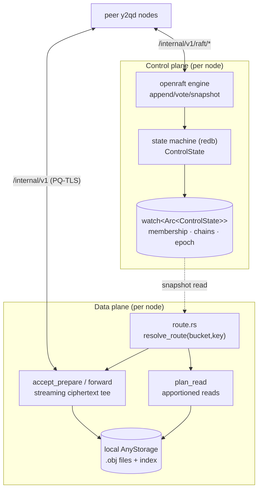
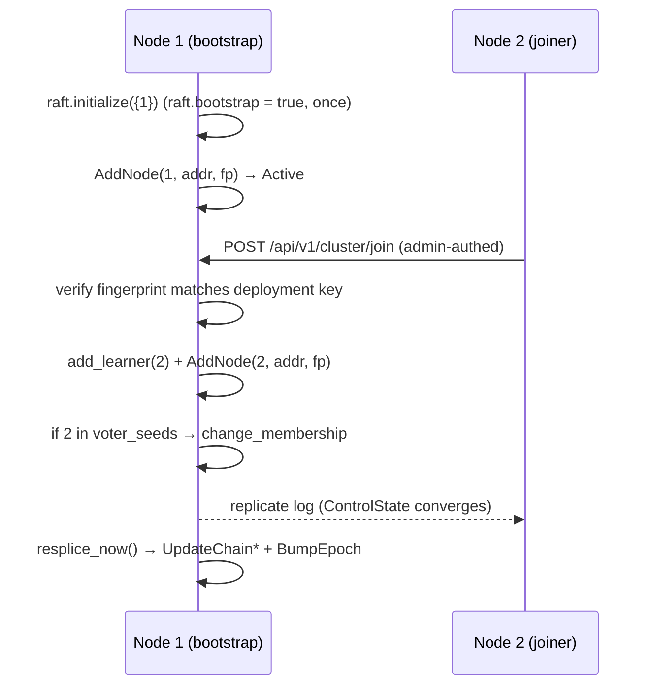
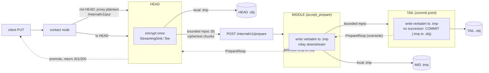

# Clustering: Raft control plane, CRAQ replication, and erasure coding

This document describes how `y2q` runs multiple `y2qd` daemons as one distributed
storage system: the **embedded Raft control plane** that replicates topology, the
**CRAQ data plane** that chain-replicates objects, and the **erasure-coding** end
state those two planes are designed to grow into.

The whole feature is gated behind `cluster.enabled` (default `false`). With it
off, the daemon is byte-for-byte the single-node store described in
[architecture.md](architecture.md); none of the machinery below runs. The cluster
code lives in the `y2q-cluster` crate, which depends on `y2q-core` and is consumed
by `y2qd` — never the reverse.

## Two planes

The system is split into two planes that share nothing but a snapshot:

| Plane | Carries | Mechanism | Crate module |
|---|---|---|---|
| **Control** | Cluster topology: membership, chain table, epoch | Embedded Raft (`openraft`) | [`control/`](../crates/y2q-cluster/src/control/) |
| **Data** | Object bytes + per-object metadata | CRAQ chain replication | [`data/`](../crates/y2q-cluster/src/data/) |

**The load-bearing discipline:** object data and per-object metadata *never* enter
the Raft log. Only low-volume topology flows through consensus. The data plane
reads the committed topology from a lock-free `tokio::sync::watch<Arc<ControlState>>`
snapshot published on every Raft apply, then routes and replicates object bytes
entirely outside Raft. This is why the design scales: consensus throughput caps
the *reconfiguration* rate (rare), not the *write* rate (hot).



## Shared-key invariant (the foundation)

Every node loads the **same deployment keystore**. `derive_mek(sk)` and the derived
Path Key are pure functions of the deployment secret key, so every node derives the
*identical* MEK and Path Key. Two consequences make the whole data plane possible:

1. The on-disk path for `(bucket, key)` is `HMAC(path_key, …)` — **identical on
   every node**.
2. Any node can decrypt any other node's envelope. **Ciphertext is portable
   between nodes verbatim — re-encryption never happens.**

The HEAD encrypts an object exactly once; every downstream replica writes the
received bytes byte-for-byte. The Raft leader refuses to admit a node whose
deployment-key fingerprint differs ([`NodeMeta::fingerprint`](../crates/y2q-cluster/src/control/types.rs)),
guarding this invariant loudly.

In cluster mode the SK is recovered at boot via **provisioned unlock**
(`Y2QD_CLUSTER__UNLOCK_SECRET` or `cluster.unlock_secret_file` unwraps
`cluster.unlock_user`'s wrapped SK), and idle-drop is disabled, so peer-forwarded
writes commit unattended for the process lifetime.

---

## Control plane: embedded Raft

### What Raft replicates

Raft replicates a log of [`ControlCmd`](../crates/y2q-cluster/src/control/types.rs)
into a [`ControlState`]. That is the entire payload:

```text
ControlCmd ::= AddNode { node_id, addr, fingerprint }
             | RemoveNode { node_id }
             | SetNodeStatus { node_id, status }      // Active|Suspect|Down|Recovering
             | UpdateChain { chain_id, members, epoch }
             | BumpEpoch

ControlState { nodes: BTreeMap<NodeId, NodeMeta>, chains: ChainTable, epoch: u64 }
```

`ControlState::apply` is the single source of truth for how the log shapes state;
it is pure and unit-tested independently of the openraft adapter. The redb-backed
log + state machine live at `<raft.log_dir>/raft.redb`
([`control/store.rs`](../crates/y2q-cluster/src/control/store.rs)); the openraft
`TypeConfig` is in [`control/raft_impl.rs`](../crates/y2q-cluster/src/control/raft_impl.rs);
the RaftNetwork rides the existing HTTP server over `/internal/v1/raft/{append,vote,snapshot}`
([`transport/raft_network.rs`](../crates/y2q-cluster/src/transport/raft_network.rs)).

### Voter / learner split

Raft commit needs a majority ack, so consensus latency grows with voter count —
the practical ceiling is ~5-7 voters. To scale past that, the cluster runs a
**small fixed voting quorum** and joins everyone else as a **learner**:

- **Voters** (`raft.voter_seeds`, sized 3/5/7) form the consensus quorum and elect
  a leader. Set `voter_seeds` identically on every node so all agree on the quorum.
- **Learners** receive the full replicated log, hold the snapshot, and serve the
  committed `ControlState` — but never vote and never lead. A learner is still a
  full *data-plane* participant (HEAD/MIDDLE/TAIL of chains, serving reads/writes).

`raft.role = auto` (default) makes a node a voter iff its `node_id` is in
`voter_seeds`, else a learner; `voter`/`learner` force it. At 3 nodes,
`voter_seeds` is all three and there are no learners.

The [`Controller`](../crates/y2q-cluster/src/control/controller.rs) wraps the
openraft handle. Joins always `add_learner` first; only `voter_seeds` members are
then promoted via `change_membership`. Effect: data throughput is unaffected (data
bypasses Raft), the voting quorum stays ~5 regardless of cluster size, and the only
true control-plane cap is the mutation rate through the single leader (low by
nature).

### Bootstrap and join



Exactly one node boots with `raft.bootstrap = true` and calls `initialize`. Others
`POST /api/v1/cluster/join`; the leader fingerprint-checks the candidate, admits it
as a learner, records it with `AddNode`, and promotes it if it is a seed voter.

### Re-splice and epoch fencing

The leader is the controller. On any membership change it runs
[`compute_resplice`](../crates/y2q-cluster/src/control/types.rs): for each already
pinned chain whose ring-computed membership now differs, it commits an
`UpdateChain` stamped with `epoch + 1`, then a single `BumpEpoch`. Steady state
commits nothing.

The **epoch** is a monotonic fencing token. Every chain entry and every
`/internal/v1` message carries it; a node rejects (`409 STALE_EPOCH`) any message
older than its committed epoch, so a node operating on a stale view of the topology
cannot corrupt a freshly re-spliced chain. Raft quorum loss halts re-splice and
cross-partition writes (correct CP behavior, surfaced as 503 + metric); reads keep
working.

---

## Data plane: CRAQ replication

CRAQ = **C**hain **R**eplication with **A**pportioned **Q**ueries (Terrace &
Freedman, USENIX ATC 2009). Strong consistency, with read throughput that scales
across replicas.

### Routing: ring → chain

Each object maps to a **chain** of `R` nodes ordered `HEAD → … → TAIL`. The mapping
is a pure function of the committed membership, so every node computes the same
chain for `(bucket, key)` with no central lookup
([`hashing/ring.rs`](../crates/y2q-cluster/src/hashing/ring.rs),
[`data/route.rs`](../crates/y2q-cluster/src/data/route.rs)):

1. `chain_id(bucket, key)` = `gxhash` (pinned seed `RING_SEED`, length-prefixed
   components) of the address → a point on a `u64` ring.
2. Each node places `virtual_nodes_per_node` (default 256) tokens on the ring.
3. The chain is the next `R` *distinct* nodes walking clockwise from the object's
   point — clamped to membership, so `R` larger than the cluster yields a shorter
   chain rather than repeating a node.

A chain is either **pinned** in the committed `ChainTable` (the leader re-splices
pinned chains on membership change) or, for a never-written key, **resolved lazily**
from the live ring at the current epoch. Either way the result is deterministic
across nodes. `RING_SEED` is a wire constant — changing it reshuffles every
assignment and demands a data migration.

[`Role`](../crates/y2q-cluster/src/hashing/chain.rs) tells a node where it sits:
`Head`, `Middle`, `Tail`, `Solo` (length-1 chain: HEAD = TAIL), or `NotInChain`.

### Write path: the streaming-encryption tee

Encryption happens **once, at the HEAD**. The hardest piece is replicating the
ciphertext down the chain without buffering whole (multi-GiB) objects.



Mechanics:

- A contact node that is **not** the HEAD proxies the **plaintext** body to the
  HEAD (`/internal/v1/put`); the HEAD does the single encryption.
- The HEAD assigns a monotonic per-object `version` (HEAD-local; CRAQ correctness
  comes from chain order, not a global counter), opens a local streaming `.tmp`,
  and writes each 4 MiB AEAD chunk through a
  [`StreamingSink::Tee`](../crates/y2q-core/src/storage/streaming_sink.rs): one copy
  to its own `.tmp`, one copy into a **bounded** (`FORWARD_BOUND = 8`) mpsc drained
  into a streamed `POST /internal/v1/prepare` to the next member. The bound is the
  backpressure invariant: a slow downstream blocks the channel → blocks the HEAD's
  read → only a few chunks are ever in flight.
- Each downstream node ([`accept_prepare`](../crates/y2q-cluster/src/data/mod.rs))
  writes the ciphertext **verbatim** into its own `.tmp` while keeping its old
  `.obj` (dirty alongside clean), relays to its successor, and commits *after* the
  downstream sub-chain commits.
- The **TAIL** has no successor → it commits (`.tmp` → `.obj`) — the **commit
  point**. Success bubbles back HEAD ← TAIL through the synchronous PREPARE
  responses; each node promotes its `.tmp` → `.obj` as its downstream resolves.
- The client PUT returns only after full-chain commit (`strong` default). All the
  metadata a replica needs to write a byte-identical `.obj` rides in the
  [`PrepareMeta`](../crates/y2q-cluster/src/data/wire.rs) JSON sidecar header
  (`X-Y2Q-Prepare`); the ciphertext is the streamed body.

**Integrity guards:** the Tee does not forward the positioned `plaintext_len`
patch, so each replica backfills it locally to stay byte-identical. A body channel
that closes early is indistinguishable from a clean EOF, so a replica that received
fewer bytes than the HEAD-committed `cipher_size` rejects with `ShortEnvelope` and
commits nothing. Timeout/abort drops the guard → `.tmp` is unlinked → no partial
commit.

### Dirty / clean and versioning

- **CLEAN** = the committed `.obj`. **DIRTY** = a staged `.tmp` held alive by the
  `StreamingPutGuard` for the write window.
- [`PendingWrites`](../crates/y2q-cluster/src/data/pending.rs): a
  `DashMap<(bucket,key), Pending>` recording in-flight writes. Presence == dirty.
  Cleanup is RAII — a `PendingGuard` clears the entry on drop, so an aborted or
  panicking write never wedges a key as permanently dirty.
- `version` lives in the committed `Metadata` (optional → legacy/single-node
  objects deserialize `version = None`, treated as clean v0), so a node recovers
  `current_clean_version` on restart. A node only ever stages a *newer* version, so
  its clean `.obj` is always the last committed one.

### Read path: apportioned queries

Any chain member can serve a read. [`plan_read`](../crates/y2q-cluster/src/data/mod.rs)
+ the pure [`serve_decision`] decide between three outcomes — serve the local
committed copy, version-query the TAIL, or fetch the committed envelope from the
TAIL — driven by the consistency mode:

| Mode (`cluster.consistency`) | Clean local copy | Dirty (write in flight) |
|---|---|---|
| `strong` (default) | serve local (fast path) | version-query the TAIL; serve local only if versions match, else fetch from TAIL |
| `eventual` | serve local | serve local (may be slightly stale) — cheapest |
| `eventual-bounded` | serve local | serve local if committed within `eventual_bound_ms`, else fall back to the strong path |

A non-member always fetches the committed envelope from the TAIL (it holds no
copy). The TAIL is the commit point, so its `version` answer is authoritative: a
dirty member never promotes its `.tmp` over its `.obj` until the TAIL's commit for
that version is confirmed. Fetched envelopes are decrypted locally (shared key) and
trimmed to the true plaintext size. This is the apportioned-read win: clean reads
fan out across all `R` replicas; only in-flight keys pay the version-query round
trip.

### Non-PUT mutations (DELETE, label edits)

DELETE and label edits route down the same chain via `/internal/v1/mutate`
([`accept_mutate`](../crates/y2q-cluster/src/data/mod.rs), carrying a
[`MutateOp`](../crates/y2q-cluster/src/data/wire.rs)). A label edit is resolved
against the HEAD's committed copy into a concrete `SetLabels` set *before* relaying,
so every member applies an identical set regardless of which node was contacted and
regardless of `Set`/`Remove`/`Replace` mode. Bucket create/config remains a
broadcast-to-all stopgap until Phase G replicates it through Raft.

### LIST / SEARCH scatter-gather

Replication means each object appears on `R` nodes, so a naive cluster-wide listing
would show duplicates. [`scatter_list`](../crates/y2q-cluster/src/data/mod.rs) fans
the list/search across every Active node, then [`merge_list_pages`] k-way merges:
dedup by `(bucket, key)` keeping the highest committed `version`, sort, and cap at
`limit`. The cursor is format-compatible with the single-node API — a bare `key`
for a single-bucket list, or the `bucket\0key` composite for a cross-bucket search.
Unreachable peers are skipped (their objects still surface from a live replica) —
CRAQ's "reads continue elsewhere" availability. Completeness holds because each
node returns its lowest `limit` keys `> after`, so the global first `limit` distinct
keys are a subset of the union of the per-node pages.

### Failure, recovery, and back-fill

A health-probe task drives leader `SetNodeStatus` commits → re-splice with a bumped
epoch:

- **TAIL dies** → its predecessor becomes TAIL and commits any held dirty versions.
- **HEAD dies** → its successor heads; uncommitted in-flight writes abort (client
  retries).
- **MIDDLE dies** → splice the neighbors; only the splice site re-syncs, reads
  continue elsewhere.
- **New / restarted node** joins as `Recovering`: it accepts writes while reads are
  redirected, and runs the back-fill protocol until caught up → leader sets
  `Active`.

**Back-fill** ([`backfill_pass`](../crates/y2q-cluster/src/data/mod.rs)): the
recovering node pulls each Active peer's manifest
(`/internal/v1/backfill/manifest` — `(key, version, cipher_sha256)` per object),
keeps only objects it *prospectively* holds (ring computed over the active
membership **plus itself**, so a node excluded from the active ring still discovers
what to pull), and for each it is missing/behind/digest-divergent on
([`need_backfill`]), streams the ciphertext envelope verbatim from
`/internal/v1/backfill/object` and commits a byte-identical replica at the carried
version. The sweep is idempotent (skips matching digests) and resumable. Crash
orphan `.tmp` files are swept by the extended stale-lock sweeper.

---

## `/internal/v1` API surface

Peer-authenticated (shared secret or mTLS), epoch-fenced, registered before the
greedy `/{bucket}/{key}` route ([`cluster.rs`](../crates/y2qd/src/cluster.rs)):

| Method | Path | Purpose |
|---|---|---|
| POST | `/internal/v1/raft/{append,vote,snapshot}` | openraft RPC |
| POST | `/internal/v1/put` | proxied client PUT (contact node → HEAD; HEAD encrypts) |
| POST | `/internal/v1/prepare` | CRAQ PREPARE (streamed ciphertext); resolves on full-chain commit |
| POST | `/internal/v1/mutate` | DELETE / label edit relayed down the chain |
| GET | `/internal/v1/version` | TAIL returns the committed version for `(bucket, key)` |
| GET | `/internal/v1/read` | TAIL returns the committed ciphertext envelope verbatim |
| GET | `/internal/v1/list` | one node's local list/search page for scatter-gather |
| GET | `/internal/v1/backfill/manifest` | `(key, version, cipher_sha256)` for recovery diff |
| GET | `/internal/v1/backfill/object` | one object's ciphertext envelope, verbatim |
| GET | `/internal/v1/health` | liveness, status, epoch, raft last-applied |

Admin (under `/api/v1/cluster/`, admin-authed): `POST /join`, `GET /status`.

**Peer auth:** v1 uses a constant-time shared-secret header (`cluster.auth =
"shared-secret"`, `Y2QD_CLUSTER__SHARED_SECRET`). Production posture is
`cluster.auth = "mtls"`, reusing the server's `client_ca_path`. User Bearer tokens
are never reused for peer traffic (they idle-drop).

---

## Configuration reference

Full `[cluster]` schema in [config.rs](../crates/y2qd/src/config.rs); see also
[configuration.md](configuration.md). Every field is defaulted, so an existing
config with no `[cluster]` block deserializes to a disabled cluster.

```toml
[cluster]
enabled = false                  # MASTER SWITCH; false => single-node, zero new behavior
node_id = ""                     # explicit u64; empty => derive + persist
advertise_addr = ""              # host:port peers dial for /internal/v1 (required if enabled)
replication_factor = 3           # R = chain length; clamped to membership
virtual_nodes_per_node = 256
consistency = "strong"           # strong | eventual | eventual-bounded
eventual_bound_ms = 2000
prepare_timeout_ms = 30000
ack_timeout_ms = 30000
auth = "shared-secret"           # shared-secret | mtls
shared_secret = ""               # prefer Y2QD_CLUSTER__SHARED_SECRET
health_probe_interval_ms = 1000
health_fail_threshold = 3
unlock = "provisioned"           # SK unwrapped at boot from a provisioned secret
unlock_secret_file = ""          # or Y2QD_CLUSTER__UNLOCK_SECRET
unlock_user = "root"             # whose wrapped SK the unlock secret recovers
peers = []                       # [{ id = 2, url = "https://10.0.0.2:8443" }, …]

[cluster.raft]
heartbeat_interval_ms = 250
election_timeout_min_ms = 1000
election_timeout_max_ms = 1500
log_dir = ""                     # empty => <storage.base_path>/_y2q_raft
bootstrap = false                # true on exactly ONE node's first boot
role = "auto"                    # voter | learner | auto
voter_seeds = []                 # node_ids forming the voting quorum; sized 3/5/7
```

---

## Erasure coding (future)

Erasure coding is **not implemented** — it is the intended end state, and the data
plane is shaped so it layers on cleanly without touching the control plane.

Today PREPARE broadcasts the **full envelope** to all `R` chain members
(replication: storage cost `R×`, any one replica reconstructs the object). EC would
instead, at the commit step, split the envelope into **k data + m parity shards**,
PREPARE distinct shards to chain members, store a shard + a shard manifest per node,
and reconstruct from any `k` shards on read (storage cost `(k+m)/k ×`, tolerating
`m` losses). Because shards are derived from the already-encrypted envelope, the
shared-key/verbatim-ciphertext invariant is preserved end to end.

Seams that change when EC lands (the control plane — chains, epoch, Raft — is
**unaffected**):

| Seam | Replication today | Erasure coding |
|---|---|---|
| [`data/mod.rs`](../crates/y2q-cluster/src/data/mod.rs) tee | broadcast identical bytes down-chain | shard-split: distinct shard per member |
| [`pending.rs`](../crates/y2q-cluster/src/data/pending.rs) | one dirty copy per key | shard set per version |
| read path ([`plan_read`]) | fetch one whole envelope | gather `k` shards + reconstruct |
| [`Metadata`](../crates/y2q-core/src/lib.rs) | `version`, `cipher_*` | + optional shard-layout fields |

These seams are the EC hook points: the EC phase is additive, never a rewrite of
the write/route/recovery machinery above.

---

## See also

- [architecture.md](architecture.md) — single-node internals (envelope, storage, index, auth)
- [configuration.md](configuration.md) — all config keys and env overrides
- [operations.md](operations.md) — running and operating the daemon
- `y2q-cluster` crate — [control/](../crates/y2q-cluster/src/control/), [data/](../crates/y2q-cluster/src/data/), [hashing/](../crates/y2q-cluster/src/hashing/), [transport/](../crates/y2q-cluster/src/transport/)
